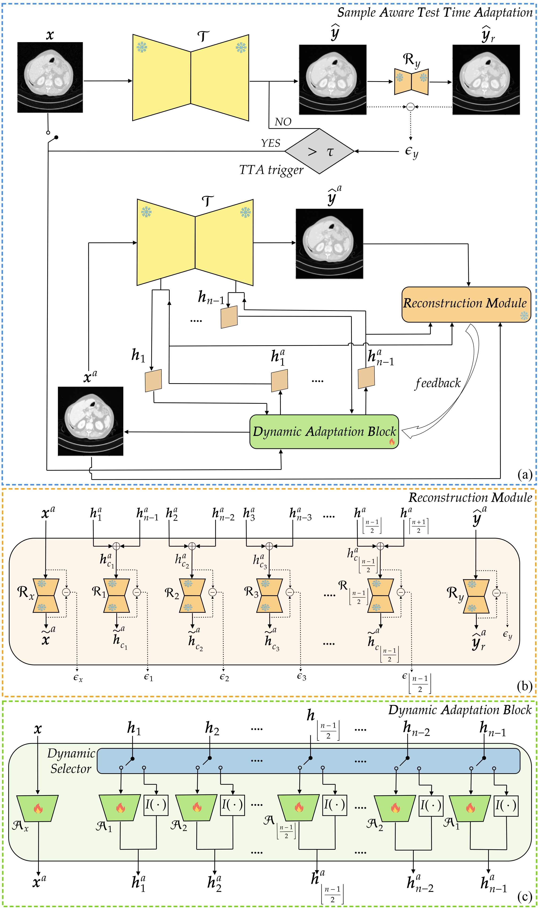
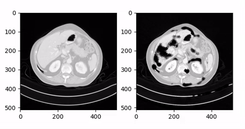

# Sample-Aware Test-Time Adaptation for Medical Image-to-Image Translation

<p align="center">
  <a href="https://scholar.google.com/citations?user=srLH7lkAAAAJ&hl=it&oi=ao">Irene Iele</a><sup>1</sup>,
  <a href="https://scholar.google.com/citations?user=nzm0qagAAAAJ&hl=it">Francesco Di Feola</a><sup>2</sup>,
  <a href="https://matteotortora.github.io">Matteo Tortora</a><sup>3</sup>,
  <a href="https://scholar.google.com/citations?user=d3yjHMMAAAAJ&hl=it&oi=ao">Rosa Sicilia</a><sup>4</sup>,
  <a href="https://scholar.google.com/citations?user=840UXEMAAAAJ&hl=it&oi=ao">Valerio Guarrasi</a><sup>4</sup>,
  <a href="https://scholar.google.com/citations?user=E7rcYCQAAAAJ&hl=it&oi=ao">Paolo Soda</a><sup>1,2</sup>
</p>

<p align="center">
  <sup>1</sup> University Campus Bio-Medico of Rome,
  <sup>2</sup> Umeå University,
  <sup>3</sup> University of Genoa,
  <sup>4</sup> UniCamillus-Saint Camillus International University of Health Sciences
</p>

---

## Overview

This repository releases the code for sample-aware Test-Time Adaptation in medical image-to-image translation.
The core code is generic and can be reused with different task models and datasets.
An LDCT Mayo Clinic example is provided to show one concrete setup.

<p align="center">
  
</p>

<p align="center">
  
</p>

---

## Repository Layout

```text
TTA.py
model/
  run_tta.py
  tta_strategies.py
  models/
  data/
  options/
  util/
weights/
  ckp/
    ldct_mayo/
      task_model/
      ae/
dataset/
scripts/
  run_tta.sh
examples/
  ldct_mayo/
    README.md
```

- `TTA.py` is the repo-root convenience entrypoint.
- `model/` contains the generic sample-aware TTA pipeline and the reconstruction-model training code.
- `scripts/` contains a generic launcher that expects paths through environment variables or explicit flags.
- `examples/ldct_mayo/` documents one concrete LDCT Mayo Clinic setup.
- `weights/` stores the LDCT Mayo example checkpoints under `ckp/ldct_mayo/` and can also host user-provided checkpoints.
- `dataset/` is a placeholder for user-provided datasets.

---

## Core Usage

The core pipeline does not assume a fixed dataset root or a fixed task model.
Pass the dataset, task checkpoint, and AE checkpoint paths explicitly.

*Customize the values below before running the command.*

```bash
# Customize these values for your run.
name=sample_aware_tta
m1=source
m2=target
sample_start=0
sample_end=10000
strategy=rndm_50
thr=threshold
ae_epoch=100
task_ckpt=/path/to/task_checkpoint.pth
ae_ckpt_dir=/path/to/ae_checkpoints

python TTA.py \
  --norm instance \
  --dataset_mode paired_slice \
  --modalities "$m1" "$m2" \
  --dataroot /path/to/your/dataset_root \
  --input_nc 1 \
  --output_nc 1 \
  --phase tta \
  --model cycle_gan \
  --netG resnet_9blocks \
  --batch_size 1 \
  --display_freq 8000 \
  --update_html_freq 1000 \
  --name "$name" \
  --checkpoints_dir ./outputs/"$name"/checkpoints \
  --gpu_ids "0" \
  --sample_range "$sample_start" "$sample_end" \
  --results_dir ./outputs/"$name"/results \
  --alr 0.0001 \
  --task_checkpoint_path "$task_ckpt" \
  --ae_checkpoint_dir "$ae_ckpt_dir" \
  --ae_epoch "$ae_epoch" \
  --tta_strategy "$strategy" \
  --tta_threshold "$thr"
```

For custom datasets, replace `--dataset_mode`, `--modalities`, and the checkpoint paths with your own values.

---

## LDCT Mayo Clinic Example

The example below uses the Mayo Clinic low-dose CT setup.
The dataset root is intentionally left generic so you can point it to your local copy.
The task-model and AE checkpoints for the example are stored under `weights/ckp/ldct_mayo/`.
The exact files are listed in [examples/ldct_mayo/CHECKPOINTS.md](examples/ldct_mayo/CHECKPOINTS.md).

*Customize the values below if you want to adapt the example to another environment.*

```bash
# Customize these values if you adapt the example.
name=ldct_mayo_sample_aware_tta
m1=LDCT
m2=HDCT
sample_start=0
sample_end=10000
strategy=rndm_50
thr=0.0064
ae_epoch=100
task_ckpt=./examples/ckp/task_model/100_net_G_A.pth
ae_ckpt_dir=./examples/ckp/ae/epoch100

python TTA.py \
  --norm instance \
  --dataset_mode paired_slice \
  --modalities "$m1" "$m2" \
  --dataroot /path/to/your/ldct_mayo_root \
  --input_nc 1 \
  --output_nc 1 \
  --phase tta \
  --model cycle_gan \
  --netG resnet_9blocks \
  --batch_size 1 \
  --display_freq 8000 \
  --update_html_freq 1000 \
  --name "$name" \
  --checkpoints_dir ./outputs/"$name"/checkpoints \
  --gpu_ids "0" \
  --sample_range "$sample_start" "$sample_end" \
  --results_dir ./outputs/"$name"/results \
  --alr 0.0001 \
  --under_sample_dataset \
  --data_phase test \
  --task_checkpoint_path "$task_ckpt" \
  --ae_checkpoint_dir "$ae_ckpt_dir" \
  --ae_epoch "$ae_epoch" \
  --tta_strategy "$strategy" \
  --tta_threshold "$thr"
```

The corresponding walkthrough is summarized in [examples/README.md](examples/README.md).

---

## Notes

- The demo image is stored as [`method_v7.jpg`](method_v7.jpg).
- The demo preview is stored as [`video_TTA_pptx.gif`](video_TTA_pptx.gif).
